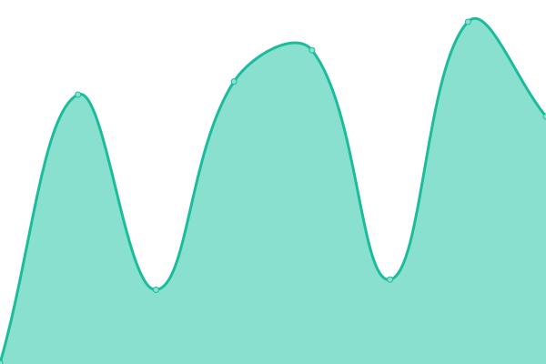

# [📈 Live Status](https://status.cord.town): <!--live status--> **🟩 All systems operational**

This repository contains the open-source uptime monitor and status page for [코드타운](cord.town), powered by [Upptime](https://github.com/upptime/upptime).

With [Upptime](https://upptime.js.org), you can get your own unlimited and free uptime monitor and status page, powered entirely by a GitHub repository. We use [Issues](https://github.com/CORDTOWN/upptime/issues) as incident reports, [Actions](https://github.com/CORDTOWN/upptime/actions) as uptime monitors, and [Pages](https://status.cord.town) for the status page.

<!--start: status pages-->
<!-- This summary is generated by Upptime (https://github.com/upptime/upptime) -->
<!-- Do not edit this manually, your changes will be overwritten -->
<!-- prettier-ignore -->
| URL | Status | History | Response Time | Uptime |
| --- | ------ | ------- | ------------- | ------ |
|  [LOONA-RSS](https://loona-rss.cord.town/) | 🟩 Up | [loona-rss.yml](https://github.com/CORDTOWN/upptime/commits/HEAD/history/loona-rss.yml) | 

 375ms
     
 | 

<a href="https://status.cord.town/history/loona-rss">100.00%</a>
    

|  [TICKET-RSS](https://ticket-rss.cord.town/) | 🟩 Up | [ticket-rss.yml](https://github.com/CORDTOWN/upptime/commits/HEAD/history/ticket-rss.yml) | 

 308ms
     
 | 

<a href="https://status.cord.town/history/ticket-rss">100.00%</a>
    

|  [MUSIC-RSS](https://music-rss.cord.town/) | 🟩 Up | [music-rss.yml](https://github.com/CORDTOWN/upptime/commits/HEAD/history/music-rss.yml) | 

 451ms
     
 | 

<a href="https://status.cord.town/history/music-rss">100.00%</a>
    

|  [MOVIE-RSS](https://movie-rss.cord.town/) | 🟩 Up | [movie-rss.yml](https://github.com/CORDTOWN/upptime/commits/HEAD/history/movie-rss.yml) | 

 372ms
     
 | 

<a href="https://status.cord.town/history/movie-rss">100.00%</a>
    

|  [TECH-RSS](https://tech-rss.cord.town/) | 🟩 Up | [tech-rss.yml](https://github.com/CORDTOWN/upptime/commits/HEAD/history/tech-rss.yml) | 

 314ms
     
 | 

<a href="https://status.cord.town/history/tech-rss">100.00%</a>
    

|  [JOURNALISM-RSS](https://journalism-rss.cord.town/) | 🟩 Up | [journalism-rss.yml](https://github.com/CORDTOWN/upptime/commits/HEAD/history/journalism-rss.yml) | 

 247ms
     
 | 

<a href="https://status.cord.town/history/journalism-rss">100.00%</a>
    

|  [Reddit-RSS](https://reddit-rss.cord.town/) | 🟩 Up | [reddit-rss.yml](https://github.com/CORDTOWN/upptime/commits/HEAD/history/reddit-rss.yml) | 

 1301ms
     
 | 

<a href="https://status.cord.town/history/reddit-rss">100.00%</a>
    

<!--end: status pages-->

[**Visit our status website →**](https://status.cord.town)

## 📄 License

- Powered by: [Upptime](https://github.com/upptime/upptime)
- Code: [MIT](./LICENSE) © [코드타운](cord.town)
- Data in the `./history` directory: [Open Database License](https://opendatacommons.org/licenses/odbl/1-0/)
